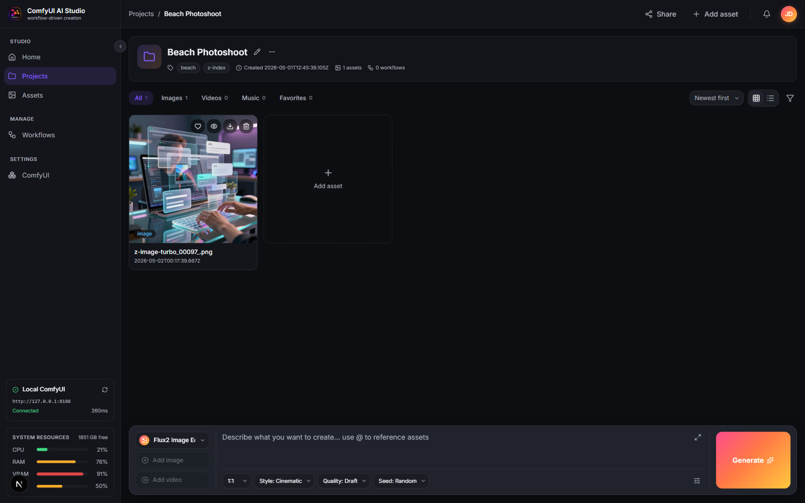
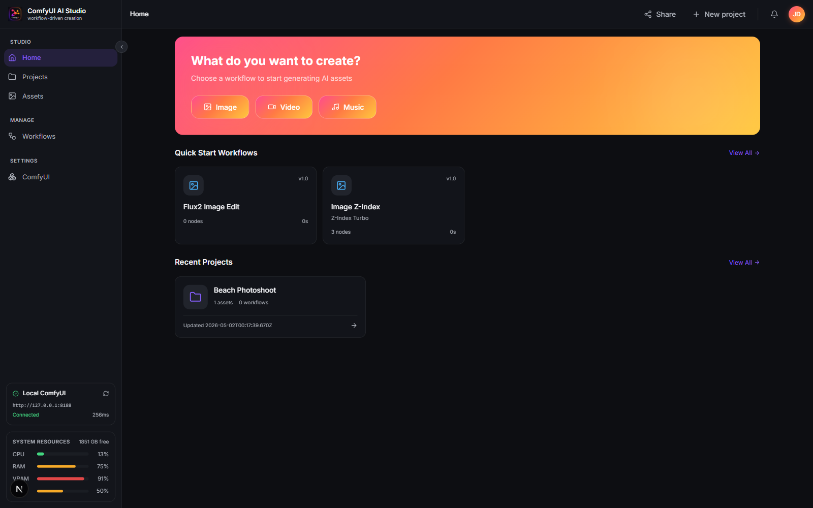
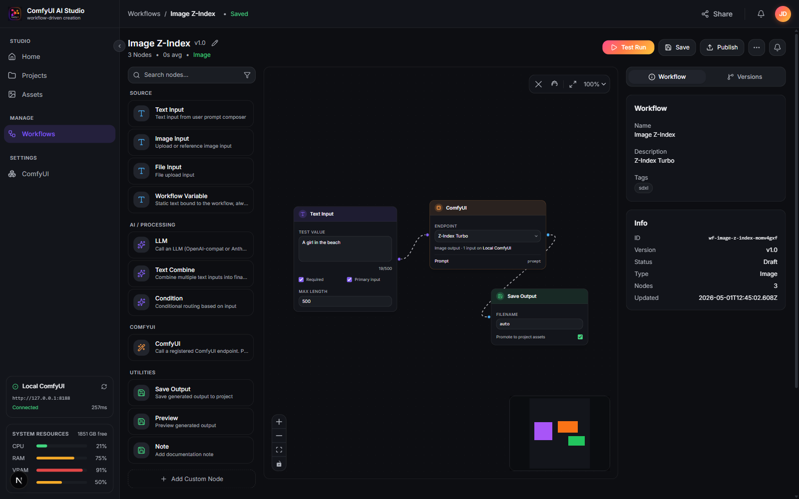
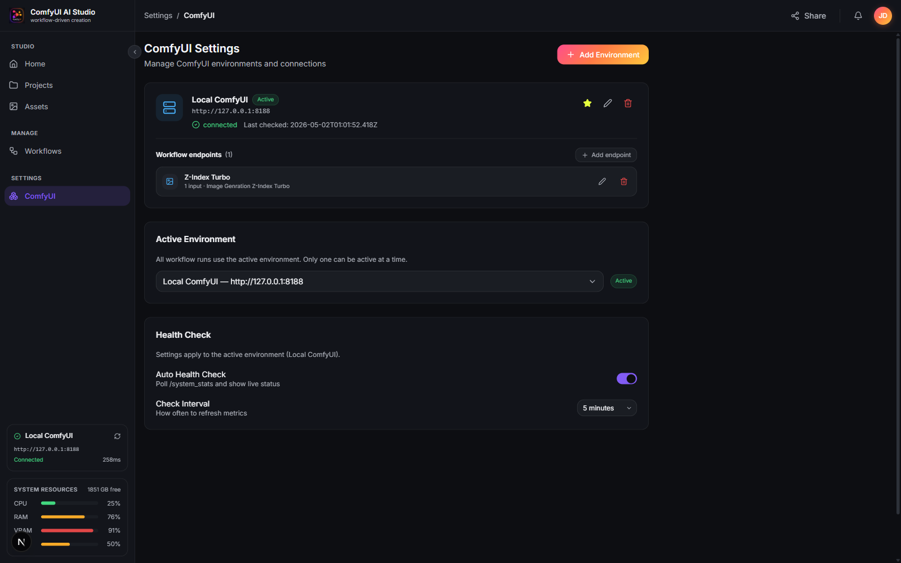
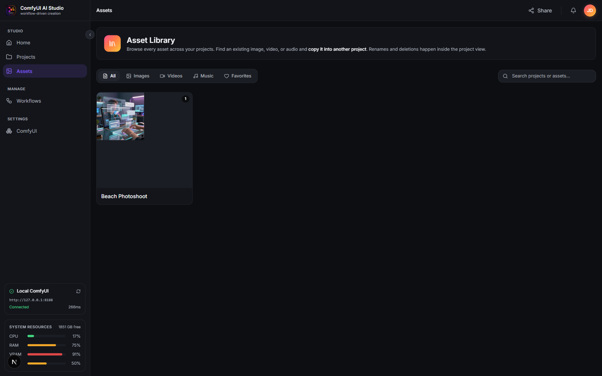
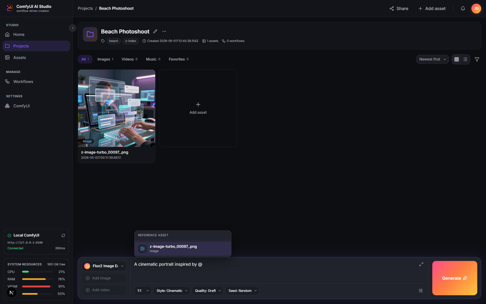

<div align="center">


# ComfyUI AI Studio

**A workflow-driven creative studio for AI image, video, and music generation — powered by ComfyUI.**

[](https://github.com/lalantony/comfyui-ai-studio/actions/workflows/ci.yml)
[](./LICENSE)
[](https://nextjs.org/)
[](https://tailwindcss.com/)
[](https://github.com/comfyanonymous/ComfyUI)
[](./CONTRIBUTING.md)

[Getting started](#getting-started) · [Walkthrough](#walkthrough-your-first-comfyui-workflow) · [Architecture](./docs/ARCHITECTURE.md) · [Contributing](./CONTRIBUTING.md)

</div>

---

ComfyUI is the most capable local-first generation engine in the AI ecosystem — but its node graph is a workshop, not a studio. **ComfyUI AI Studio** wraps it in a creator-facing workspace: organized projects, an asset gallery, a prompt composer with `@`-mentions, and a visual workflow editor that **chains multiple ComfyUI workflows end-to-end** as a single run. Build once, run it from a clean composer alongside the rest of your work.

The studio runs locally, talks to your existing ComfyUI server (local **or** remote), and stores everything on your filesystem. No cloud, no telemetry, no lock-in. **MIT-licensed and free** — built to give back to the ComfyUI community that makes this possible.

<p align="center">
  
</p>

## Highlights

- 🔗 **Multi-stage ComfyUI chains** — wire `ComfyUI A → ComfyUI B → …` as a single run. Every stage's output auto-saves to the gallery the moment it completes, so a 4-stage pipeline gives you 4 trackable assets. Stop mid-flight without losing finished stages, then **resume from the failed step** without re-paying upstream GPU cost.
- 🗂 **Projects** — group assets, prompts, and runs by creative project. Each has a clean gallery (image/video/music/files), a floating prompt composer with Stop + per-stage progress, and a **Runs tab** showing every persisted run with replayable timelines and one-click "Run again".
- ✨ **`@`-mention assets** in your prompt — Radix popover scoped to your workflow's expected input type, with structured `AssetRef` chips above the textarea. Mentions automatically suspend inside ` ``` ` code fences.
- 🎯 **Pre-flight input validation** — the composer derives the workflow's input contract (text + image + video slots, with Reference / Init / Mask roles) and validates *before* a run starts. Workflows with multiple image inputs surface named slot indicators; missing inputs become specific toasts, not mid-run failures.
- 🧩 **Visual workflow editor** built on React Flow — drag-and-drop nodes, inline editing, per-node run state, real-time progress, **debounced auto-save** with `beforeunload` guard.
- ⚡ **Production-grade workflow runtime** — topological-sort DAG executor, per-project FIFO queue, SSE event bus with `_seq` deduplication (no race-window event drops), AbortSignal-aware cancellation throughout.
- 🛟 **ComfyUI resilience** — WebSocket ping/pong heartbeat (15s/30s) plus **one-shot reconnect** with prompt-id correlation, parallel `getHistory` polling fallback, env-configurable hard timeout (default 30 min), HTTP retry/backoff (1s/2s/4s) on every outbound call. A 200s+ video run that drops the WS still completes cleanly.
- 🪟 **Live stage previews + activity log** — the test panel shows every stage's output as a card the moment it lands, plus a copy-to-clipboard activity log of every WS open/close, polling probe, and completion-path decision — designed for bug-report attachments.
- 🎨 **First-class ComfyUI integration** — register any `workflow_api.json` as an endpoint, **auto-introspect** inputs/outputs, then drop a ComfyUI node into a workflow. Endpoints carry per-stage timeout config.
- 🤖 **Drop-in LLM providers** — OpenAI-compatible (OpenAI, OpenRouter, Together, Ollama, vLLM) plus native Anthropic. Stream tokens into prompt-shaping nodes.
- 🛡 **Safe by default** — local-first storage in `.studio-data/`, content-addressable blob pool with reference-counted GC and per-hash mutex, **SSRF allowlist** on remote ComfyUI URLs (blocks file://, AWS metadata, RFC1918, link-local), **upload size + MIME caps** with a contributor-extensible registry. No database server, no telemetry, no cloud round-trip.
- 📊 **Live health widget** — built-in CPU/RAM/VRAM/Disk monitoring of your active ComfyUI environment.
- ✅ **Tested + strict TS** — 298 Vitest tests across runtime, storage, executors, SSE, retry, SSRF policy, upload policy, run history, and resume logic; TypeScript strict mode enforced at build.
- 🌑 **Dark studio aesthetic** — designed for late-night creative work, not a dashboard.

## Screenshots

| Home dashboard | Project + composer |
|---|---|
|  |  |

| Workflow canvas | ComfyUI settings |
|---|---|
|  |  |

| Asset library (cross-project) | `@`-mention assets in the composer |
|---|---|
|  |  |

## Getting started

### Prerequisites

- **Node.js** ≥ 22 (we use `fs.statfs` and other modern Node APIs)
- **npm** ≥ 10 (bundled with Node 22)
- **A running ComfyUI instance** — local at `http://127.0.0.1:8188` is the easiest path. Remote instances with bearer auth or Comfy Org API keys also work.

### Install + run

```bash
# Clone the repo
git clone https://github.com/lalantony/comfyui-ai-studio.git
cd comfyui-ai-studio

# Install
npm install

# Start the dev server (Turbopack, port 3200)
npm run dev
```

Open <http://localhost:3200>.

> **Port 3200** is hard-coded in `package.json`. Override per-run with `npm run dev -- -p 3300`.

### Production build

```bash
npm run build   # strict TypeScript checking happens here, not in dev
npm run start   # serve the built app on port 3200
```

### Configuration

| Variable | Default | What it does |
|---|---|---|
| `STUDIO_DATA_DIR` | `<repo>/.studio-data` | Where projects, assets, workflows, runs, and ComfyUI environments are persisted. Override to put it on a different drive or a synced folder. |

The directory is gitignored by default — your creative work never accidentally lands in version control.

## Walkthrough: your first ComfyUI workflow

A 3-minute end-to-end run. See the [full guide](./docs/COMFYUI-WORKFLOW-GUIDE.md) for screenshots, troubleshooting, and the introspection details.

### 1. Connect your ComfyUI server

`Settings → ComfyUI → Add Environment` → name it, set the base URL (`http://127.0.0.1:8188` for local), pick auth mode, save.

The status widget at the bottom-left of the sidebar will start pinging `/system_stats` and showing live CPU / RAM / VRAM / Disk for the host plus connection latency.

> 🌥 **Cloud / hosted ComfyUI**: the studio supports any reachable URL plus the auth modes ComfyUI itself standardises on — bearer token or `extra_data.api_key_comfy_org`. **Most of our day-to-day testing is against local ComfyUI;** if you run on RunPod, ComfyDeploy, Salad, or another hosted provider and hit anything weird, [open an issue](../../issues/new/choose) — first-hand reports from cloud users are the fastest way to harden this path. Help wanted!

### 2. Register a workflow endpoint

In the same settings page, expand your environment → **Add endpoint** → paste a `workflow_api.json` exported from ComfyUI's dev mode.

> 💡 **Where do I get `workflow_api.json`?** In ComfyUI itself: `Settings → Enable Dev mode Options`, then on any workflow click `Save (API Format)`. We've also bundled four ready-to-use examples in [`docs/examples/comfyui-workflows/`](./docs/examples/comfyui-workflows/) — Z-Image Turbo, Ernie Image, LTX2 video, ACE-Step audio.

Hit **Introspect** — the studio parses the prompt graph and suggests:
- Which nodes are user inputs (CLIPTextEncode → text, LoadImage → image, etc.)
- Which node is the final output (SaveImage / VHS_VideoCombine / SaveAudio)
- Which fields belong to each input

Review the suggestions, tweak labels and required-flags, save.

### 3. Build a workflow

`Workflows → New Workflow` → drop a **Text Input** node and a **ComfyUI** node (set its endpoint to the one you just registered). Wire `Text → ComfyUI.prompt`. That's it — the ComfyUI node auto-saves its output to your project gallery (or the test outputs dir in test mode), so most workflows don't need a separate Save Output node.

> 💡 **Multi-stage chains** are first-class: drop a second ComfyUI node, wire the first one's output into the second one's image input, and every stage shows up as soon as it finishes. Stop mid-flight without losing finished stages.
>
> The **Save Output** node is still available — useful for renaming a ComfyUI output to a custom filename, or for non-ComfyUI primitives (saving an LLM's text response to a file).

### 4. Run it

Open any project (or create one), pick the workflow from the composer dropdown, type a prompt, hit **Generate**. The Generate button transitions to a **Stop** button while running; live per-stage progress streams via SSE; output assets land in the gallery as each stage completes (not just at the end).

For workflow-only validation (no project yet), use **Test Run** in the workflow editor — outputs go to `.studio-data/runs/<runId>/outputs/` and surface as cards in the **Stage Previews** panel. The panel includes a collapsible **Activity Log** with copy-to-clipboard — paste it into a bug report if anything goes wrong.

## Architecture overview

> See [`docs/ARCHITECTURE.md`](./docs/ARCHITECTURE.md) for the full deep-dive.

```
┌─────────────────────────────────────────────────────────────────┐
│  Browser (Next.js client)                                       │
│  ├─ React 19 + Tailwind v4 + ShadCN primitives                 │
│  ├─ Zustand stores (one per domain)                            │
│  └─ React Flow canvas with custom node types                   │
└────────────────────────────┬────────────────────────────────────┘
                             │  REST + SSE
┌────────────────────────────▼────────────────────────────────────┐
│  Next.js API routes  (runtime: nodejs, server-only modules)     │
│  ├─ /api/projects/...   /api/workflows/...                     │
│  ├─ /api/comfy/environments/...   /api/workflow-runs/...       │
│  └─ Workflow runtime: queue → topological executor → SSE bus   │
└──────────┬──────────────────────────────────┬───────────────────┘
           │ filesystem                       │ HTTP + WS
           ▼                                  ▼
┌────────────────────────┐         ┌──────────────────────────────┐
│  STUDIO_DATA_DIR       │         │  ComfyUI server              │
│  projects/             │         │  /system_stats /prompt /view │
│  workflows/            │         │  /history /upload/image /ws  │
│  comfy-environments/   │         └──────────────────────────────┘
│  runs/                 │
└────────────────────────┘
```

The filesystem under `STUDIO_DATA_DIR` is the **single source of truth**. There's no database server. Projects, assets (binary + JSON sidecar), workflows (canvas DAG JSON), ComfyUI environments + endpoints, and run histories all round-trip through plain files. A fresh install starts empty — you create everything through the UI.

## Tech stack

- **Next.js 16** (App Router, Turbopack dev) — React Server Components for server-only data, Client Components for interactive surfaces
- **React 19** + **TypeScript 6** (strict mode, enforced at build time)
- **Tailwind CSS v4** — CSS-first config, all design tokens in `app/globals.css` under `@theme` and `@utility`
- **ShadCN UI primitives** — `Button`, `Dialog`, `Switch`, `Tabs`, `Select` in `components/ui/`
- **React Flow (`@xyflow/react` v12)** — workflow canvas
- **Zustand** — per-domain state stores (`useProjectStore`, `useWorkflowStore`, `useEnvironmentStore`, `useUIStore`)
- **`ws`** — WebSocket client for ComfyUI execution events with application-level heartbeat
- **Vitest** — 298 tests covering the runtime, storage layer (blob pool refcount invariants, atomic writes), SSE event-bus race semantics, ComfyUI executor's three-path completion race, multi-stage chain behaviour, retry/backoff, SSRF allowlist, upload allowlist, run history, and resume-from-failed-step validation

## Repository layout

```
app/                          Next.js App Router (UI + API routes)
  (studio)/                   Authenticated app shell
  api/                        Server routes (all runtime: "nodejs")
components/
  app-shell/                  Sidebar, topbar, status widget
  projects/                   Gallery + prompt composer
  workflows/                  Canvas, node library, inspector
  nodes/                      Custom React Flow nodes
  shared/                     App-specific composed UI
  ui/                         ShadCN primitives
  settings/                   Settings dialogs + endpoint editor
hooks/                        Cross-cutting hooks (useHealthMonitor, …)
lib/
  server/                     `import "server-only"` modules
    workflow/                 Runtime (queue, executors, SSE bus, run store)
    providers/                ComfyUI client + LLM adapters
  nodeTemplates.ts            Static catalog (palette + composer controls)
stores/                       Zustand stores
types/index.ts                Single barrel of shared domain types
docs/
  ARCHITECTURE.md             Technical deep-dive (start here as a contributor)
  COMFYUI-WORKFLOW-GUIDE.md   Step-by-step ComfyUI integration guide
  examples/                   Sample workflow_api.json files
  screenshots/                README screenshots
```

## Recently shipped

- ✅ **Run history per project** — every persisted run shows up in a Runs tab with timestamp, status, output thumbnails, replayable event timeline, and a one-click "Run again"
- ✅ **Resume from failed step** — a 7-stage chain that fails on stage 5 is no longer a re-run from scratch. The studio re-uses every successful upstream output and picks back up at the failure point, validating asset existence + workflow-hash unchanged
- ✅ **Composer pre-flight + multi-image slots** — a single shared `inputContract` derives the workflow's required slots (text / image / video / Reference / Init / Mask), validates the composer before submission, and surfaces named slot indicators when ≥2 image inputs are present
- ✅ **Connection reliability** — one-shot WebSocket reconnect with prompt-id correlation, HTTP retry/backoff on every outbound ComfyUI call (network errors + 5xx), 15s SSE comment-heartbeat to defeat proxy idle-kills
- ✅ **SSRF allowlist + upload caps** — `lib/server/baseUrlPolicy.ts` blocks file://, AWS metadata, RFC1918, link-local, ULA, multicast, and IPv4-mapped bypasses on remote envs; `lib/uploadPolicy.ts` is a contributor-extensible registry with per-type size caps and env overrides ([UPLOAD-POLICY](./docs/UPLOAD-POLICY.md))
- ✅ **Multi-stage ComfyUI chains** — wire ComfyUI nodes end-to-end with auto-save between stages, live previews, Stop-mid-flight semantics
- ✅ **Plugin system** — three-file manifest/executor/component layout under `plugins/builtin/`; [cookbook](./docs/PLUGIN-COOKBOOK.md) + [API doc](./docs/PLUGIN-API.md) available
- ✅ **Auto-save on the canvas** — debounced 1s after last edit, dirty indicator in the header, `beforeunload` guard
- ✅ **Activity log + copy-to-clipboard** — every WS lifecycle decision and completion-path winner recorded for bug reports
- ✅ **298 Vitest tests** — runtime, storage, executors, SSE, retry, SSRF policy, upload policy, run history, resume; strict TS enforced at build

## Roadmap (selected)

- 🌌 **Workflow sharing gallery** — community-curated workflow exchange. Browse, fork, and contribute workflows with a single click. Workflows stay user-owned by default; opt-in to publish.
- 🧩 **Sandboxed third-party plugin runtime** — the plugin contract exists; making external plugins safe to install (resource limits, declared permissions) is the next step.
- 📜 **Workflow versioning + diff** — surface version history, allow rollback, diff between versions.
- 🎬 **Output post-processing** — frame extraction, thumbnail generation, ICC color management.
- 🔌 **More LLM providers** — Google Vertex, Cohere, Mistral.
- 🔐 **Encrypted API key storage** — keys live plaintext in `workflow.json` today (mitigated by `.studio-data/` being gitignored + local-only). Move to OS keychain or AES-GCM the moment we add any sync/cloud surface.
- 🌥 **Cloud-hosted ComfyUI hardening** *(help wanted)* — works against arbitrary URLs + auth modes today, but most testing is local. First-hand reports from RunPod / ComfyDeploy / Salad / etc. will sharpen this path; see the callout above.

See the [working backlog](./docs/BACKLOG.md) for medium-priority follow-ups with file:line refs — a great place to pick up your first contribution. Have a feature request? [Open an issue](../../issues/new/choose).

## Contributing

We'd love your help. The community is what's going to make this better than any single team could. Read [`CONTRIBUTING.md`](./CONTRIBUTING.md) for dev setup, conventions, and how to land a PR. New contributors should start with [`docs/ARCHITECTURE.md`](./docs/ARCHITECTURE.md).

This project follows the [Contributor Covenant Code of Conduct](./CODE_OF_CONDUCT.md). Please read it before participating.

## Security

If you discover a vulnerability, **don't** open a public issue. Use private disclosure as described in [`SECURITY.md`](./SECURITY.md).

## License

[MIT](./LICENSE) © ComfyUI AI Studio contributors.

## Acknowledgements

This project stands on the shoulders of the open-source AI community:

- **[ComfyUI](https://github.com/comfyanonymous/ComfyUI)** — the generation engine that makes everything possible
- **[xyflow / React Flow](https://reactflow.dev/)** — the canvas library powering the workflow editor
- **[ShadCN UI](https://ui.shadcn.com/)** — primitive components and design conventions
- **[Lucide](https://lucide.dev/)** — icon set
- **[Tailwind CSS](https://tailwindcss.com/)** and **[Radix UI](https://www.radix-ui.com/)** — styling and accessible primitives

Built with care to give back to the ComfyUI community. ❤️
